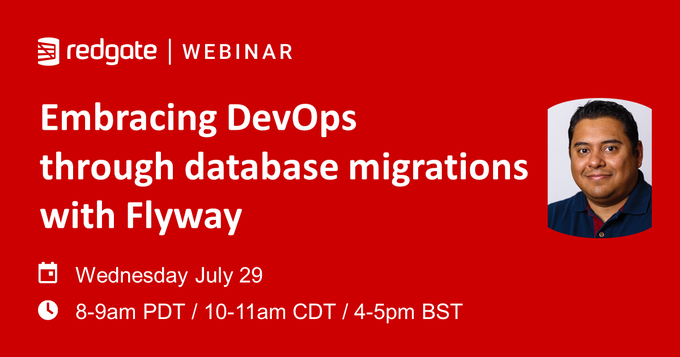

# Redgate - Flyway webinar
## [Embracing DevOps through database migrations with Flyway](https://bit.ly/2P33nGz)

"Evolutionary Database Design" is the best phrase to describe database migrations. But what do we know about database migrations using PostgreSQL containers?

This session will provide you with answers and guidelines to get you started with Database DevOps practices for your organization. You will learn the aspects, methods, and strategies to build and manage your database deployments through CI/CD pipelines with open source tools like Flyway, Jenkins, and Kubernetes.

You will be able to build your first database migration through a CI/CD pipeline at the end of this session.

## **Prerequisites**  
* Download [Flyway comand-line](https://flywaydb.org/download/) | [container](https://hub.docker.com/r/flyway/flyway)
* Experience with PostgreSQL databases and software development
* Familiarity with containers

## **Demos**  
* [Database migrations with Flyway](Demo_01)
* [CI/CD pipelines with Flyway](Demo_02)
* [CI/CD pipelines with Flyway](Demo_03)

## **Other**  
* [Kubernetes resources](Kubernetes)  
These are the collection of Kubernetes resources I used to build the Kubernetes platform for this demo.  

## Questions?
If you have questions or comments about this demo, don't hesitate to contact me at <crobles@dbamastery.com>

## Follow me
   